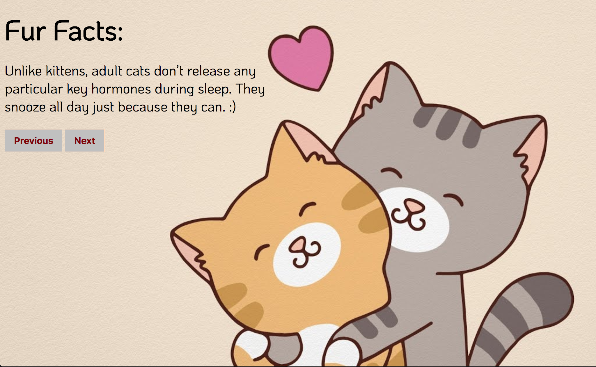

# Fur Facts
Learn everything you need to know about cats with this simple cat facts api.

**Link to project:** https://peaceful-joliot-b4ac23.netlify.com/

## How It's Made:

**Tech used:** HTML5, CSS3, JavaScript, and Cat Fact API.

This project was written in JavaScript using the fetch method to access the Cat Fact API. When a user enters the site, the API returns an array of cat facts. The user is then able to traverse this array of cat facts using the next and previous buttons. This project was designed using CSS3.

## Lessons Learned:

This project furthered my understanding of APIs.

## Related Projects:
Take a look at these projects that I have in my portfolio:

**NASA Photo of the Day API:** https://gallant-pasteur-e1c256.netlify.com/

**Music Database API:** https://zen-bose-c1b511.netlify.com/

**Pokemon API:** https://github.com/alecortega/patch-panel
